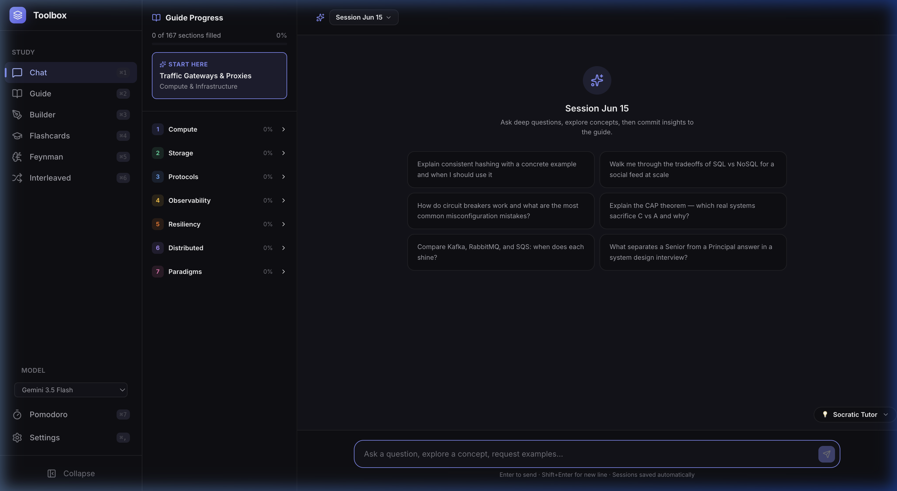
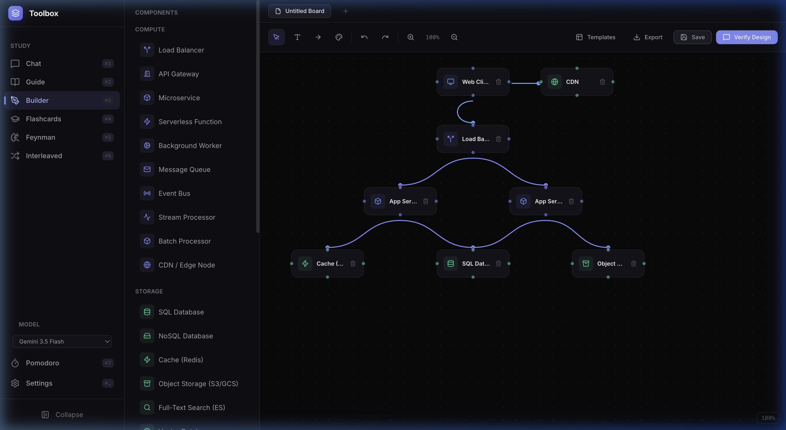
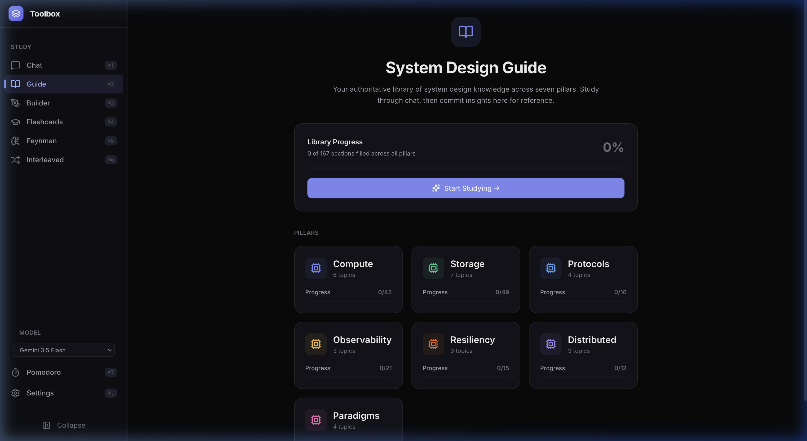
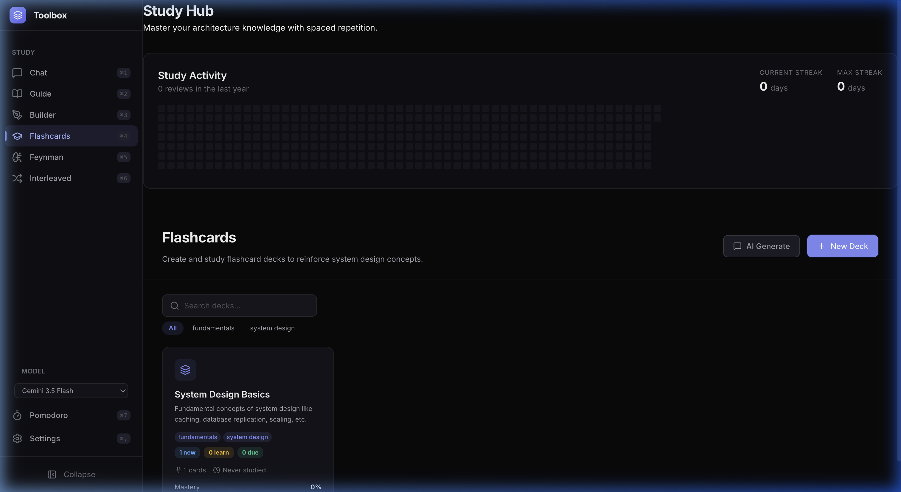
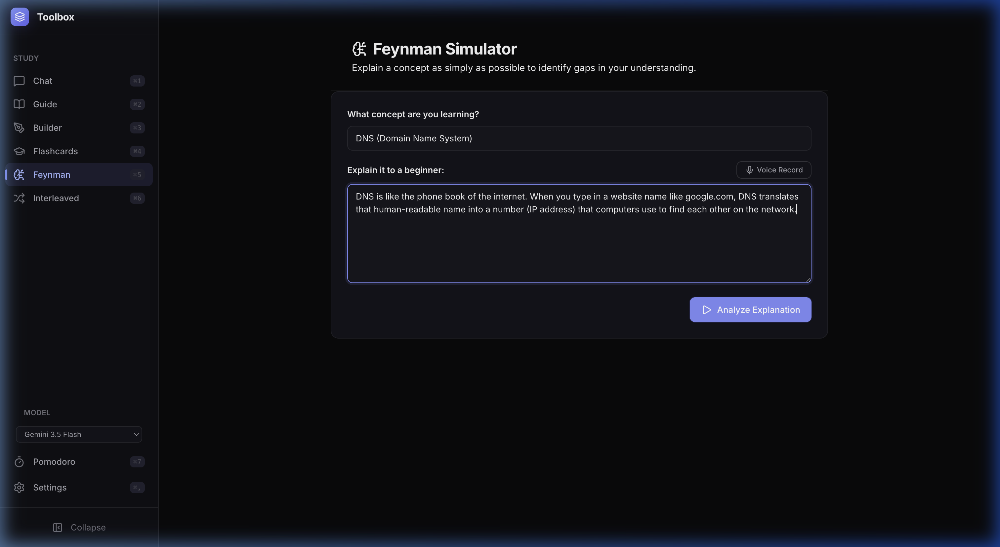

<div align="center">

# 🧰 Toolbox

**A self-hosted AI study hub for system design interviews**

[](https://hub.docker.com)
[](LICENSE)

</div>



Toolbox is a self-hosted web app that brings together everything you need to prepare for system design interviews: an AI tutor, an editable knowledge library, a drag-and-drop architecture whiteboard, spaced-repetition flashcards, and a Pomodoro timer — all in one dark, focused interface.

---

## ✨ Features

| Feature | Description |
|---------|-------------|
| 🤖 **AI Learning Chat** | Session-based chat with 4 AI personas (Socratic, ELI5, Strict, Devil's Advocate), topic-specific starter prompts, and concept map generation |
| 📖 **Knowledge Guide** | 7-pillar structured library with AI-assisted Commit flow to save learnings from chat sessions |
| 🎨 **Architecture Builder** | Drag-and-drop whiteboard with 20+ components, bezier connections, templates, and AI design verification |
| 📚 **Flashcards + SRS** | SM-2 spaced repetition system with per-deck settings, card browser, deck stats, and a study activity heatmap |
| 🧠 **Feynman Simulator** | Voice-enabled Feynman technique: explain a concept, get structured AI feedback on gaps |
| 🔀 **Interleaved Review** | Study all due cards across every deck in a single shuffled session |
| 🍅 **Pomodoro Timer** | Persistent focus timer with plant gamification (🌱→🌸→🥀) and Strict Mode |
| ⚙️ **Shadow Memory** | The AI learns your timeline, strengths, and goals across sessions for personalized coaching |

---

## 📸 Screenshots

<table>
  <tr>
    <td align="center"><em>Architecture Whiteboard Builder</em></td>
    <td align="center"><em>Structured Knowledge Guide</em></td>
  </tr>
  <tr>
    <td></td>
    <td></td>
  </tr>
  <tr>
    <td align="center"><em>Spaced Repetition Flashcards</em></td>
    <td align="center"><em>Feynman Technique Simulator</em></td>
  </tr>
  <tr>
    <td></td>
    <td></td>
  </tr>
</table>

---

## 🚀 Quick Start

### Docker Compose (Recommended)

```bash
git clone https://github.com/arvarik/toolbox.git
cd toolbox
cp .env.example .env
# Add your API keys to .env (or configure via the Settings UI)
docker compose up -d
```

Access at `http://your-server:3100`.

> Get a free Gemini API key at [Google AI Studio](https://aistudio.google.com/apikey)

### Local Development

```bash
npm install
npm run dev   # Vite (5173) + Express (3100)
```

---

## 📚 Documentation

| Document | Description |
|----------|-------------|
| [User Guide](docs/user-guide.md) | Complete guide to all features and workflows |
| [API Reference](docs/api.md) | Full REST API — every endpoint, request/response shape |
| [SRS Algorithm](docs/srs-algorithm.md) | SM-2 implementation, state machine, Hypercorrection Penalty |
| [Deployment Guide](docs/deployment.md) | Docker, Proxmox LXC, Nginx/Caddy setup |
| [Architecture](docs/architecture.md) | Tech stack, data model, AI integration |
| [Design Reference](docs/design.md) | CSS design system, component patterns, motion guidelines |
| [Agent Instructions](docs/AGENTS.md) | For AI coding agents — rules, patterns, gotchas |
| [Contributing](CONTRIBUTING.md) | Dev setup, coding standards, PR process |

---

## ⚙️ Configuration

| Variable | Default | Description |
|----------|---------|-------------|
| `PORT` | `3100` | Server port |
| `DB_PATH` | `./data/toolbox.db` | SQLite database path |
| `GEMINI_API_KEY` | — | Gemini API key (can also be set via Settings UI) |
| `CLAUDE_API_KEY` | — | Claude API key (can also be set via Settings UI) |

All user data lives in a single SQLite file — back it up by copying that file.

---

## 🛠️ Tech Stack

React 19 · Vite · React Router · Zustand · Vanilla CSS · Node.js · Express · SQLite (`better-sqlite3`) · Google Gemini API · Docker

---

## 📄 License

MIT
